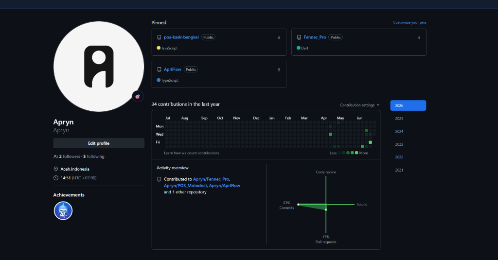

# ApriFlow — Asisten Finansial Pribadi Pintar & Terkontrol

ApriFlow adalah aplikasi pencatatan keuangan (cash flow) pribadi yang pintar, praktis, dan aman. Aplikasi ini dirancang agar Anda dapat mengontrol keuangan dengan mudah menggunakan teknologi AI dan fitur perlindungan privasi saldo secara instan.

Tersedia dalam versi **Aplikasi Mobile (Android APK & iOS)** serta **Aplikasi Web (PWA)**.



---

## Panduan Penggunaan & Instalasi

### 1. Versi Aplikasi Web (PWA - Tanpa Instalasi)
Untuk penggunaan cepat di HP Android atau iPhone tanpa perlu mengunduh file APK:
1. Buka browser (Safari di iPhone / Chrome di Android) dan kunjungi: [apriflow.vercel.app](https://apriflow.vercel.app).
2. Ketuk tombol **Share/Menu** pada browser Anda.
3. Pilih opsi **"Add to Home Screen"** (Tambahkan ke Layar Utama).
4. Aplikasi akan muncul di layar HP Anda dan dapat dibuka secara layar penuh (full screen) layaknya aplikasi native.

### 2. Versi Aplikasi Mobile Native (Android & iOS)
Aplikasi ini mendukung kompilasi native menggunakan Capacitor.

#### Android APK
Untuk mem-build berkas `.apk` secara lokal:
1. Jalankan proses build aset web:
   ```bash
   npm run build
   ```
2. Sinkronisasikan aset ke modul Android:
   ```bash
   npx cap sync
   ```
3. Buka proyek di Android Studio untuk melakukan ekspor APK:
   ```bash
   npx cap open android
   ```

#### iOS App
Untuk mem-build proyek iOS (membutuhkan Xcode & macOS):
1. Jalankan sinkronisasi aset:
   ```bash
   npx cap sync
   ```
2. Buka proyek di Xcode untuk melakukan kompilasi:
   ```bash
   npx cap open ios
   ```
*(Catatan: Build otomatis untuk iOS juga berjalan di cloud setiap kali kode di-push ke GitHub melalui GitHub Actions).*

---

## Fitur Utama

### Perlindungan Privasi Saldo (Visibility Toggle)
Sembunyikan seluruh data nominal sensitif di dashboard (seperti total aset, sisa bersih, pemasukan, pengeluaran, anggaran, dan progres target tabungan) dengan satu ketukan tombol ikon mata di header atas. Pilihan visibilitas disimpan secara lokal sehingga tidak akan hilang saat aplikasi dimuat ulang.

### Pencatatan Transaksi Otomatis dengan AI
Catat pemasukan atau pengeluaran secara instan dengan cara mengetik kalimat percakapan alami (seperti *"beli kopi 25rb tunai"* atau *"gajian 5 juta masuk rekening bank"*). Sistem AI akan otomatis memproses nominal, metode bayar, dan kategori transaksi secara akurat.

### Neo-Brutalist Dashboard & Analitik Cash Flow
Visualisasi keuangan bertema dark-mode premium yang responsif dengan deteksi otomatis status pengeluaran (Aman, Waspada, atau Bocor) serta grafik riwayat alur kas bulanan.

---

## Setup Pengembang (Lokal)

### 1. Dependensi & Database
```bash
npm install
```
Konfigurasikan database PostgreSQL menggunakan berkas skema di `supabase/migrations/001_phase1_schema.sql` pada proyek Supabase Anda.

### 2. Environment Variables
Buat berkas `.env.local` dan masukkan kunci akses Supabase Anda:
```env
NEXT_PUBLIC_SUPABASE_URL=https://proyek-anda.supabase.co
NEXT_PUBLIC_SUPABASE_ANON_KEY=kunci-anon-anda
```

### 3. Menjalankan Server Lokal
```bash
npm run dev
```
Akses server lokal melalui http://localhost:3000.
